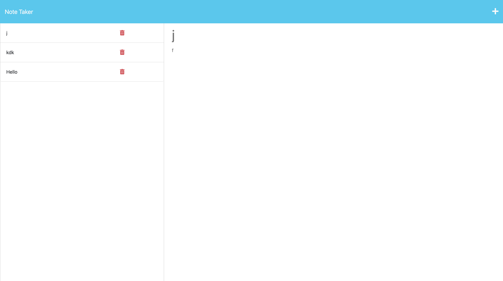

# Note Taker

## Description

Note taker that be used to write and save notes using express.js, and node.js to retrieve note data from a json file.The final application connects frontend to backend then deploy to heroku.

## Table of Contents

- [Installation](#installation)
- [Usage](#usage)
- [Credits](#credits)
- [License](#license)
- [Contact](#contact)

## Installation

I used the tools that I had on my computer, like Git, Vscode, Github, and Google. First, I cloned the repo into my local file, made a GitHub repo, and named both the local and global repo the "Refactor-accessibility-web". I opened the file in my VScode and started coding the project, and used Chrome developer tools to live to check the website for errors and stuff. Then I push it into my GitHub for deployment.

## Usage

## Credits

https://www.npmjs.com/package/uuid

## License

ISC

## contact

email: anniebui0110@gmail.com
github: https://github.com/simplyannzz
